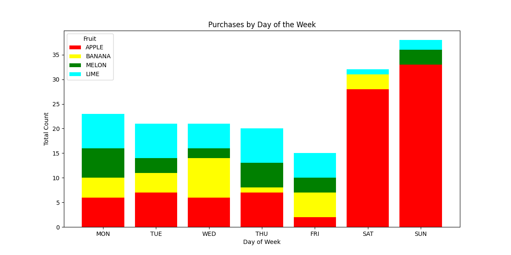

# Shopping Cart System

## Overview

This repository contains a shopping cart system implementation with a Java backend, JavaScript API layer, and Python
analytics utility.

# Part 1: Shopping Cart Java Backend (/java-backend)

#### Implementation Thought Process

The Java backend was designed with the following considerations:

1. **Single Cart Focus**: The problem statement requires operations on a single shopping cart, so the solution focuses
   on managing a single cart instance.
2. **Database Consideration**: Given the time constraints and single-cart scope, using a proper database (SQL or NoSQL)
   was deemed unnecessary and overly complex.
3. **In-Memory Storage**: A `ConcurrentHashMap` was chosen as an in-memory data structure to store cart items, with each
   add operation being persisted to an AOF file for durability.
4. **AOF Support**: The AOF file allows for persistent storage of cart updates, ensuring data integrity in the event of
   crashes or power failures. Database state can be recreated anytime by replaying the AOF file.
5. **Reporting Support**: To enable meaningful analytics in the Python utility, a timestamp field was included with each
   cart update, providing an additional vector to get meaningful insights from shopping cart data.

#### Advantages

- **Speed of Development**: The single-cart focus and in-memory approach allowed for rapid implementation within the
  time limit.
- **Meets Requirements**: The solution effectively satisfies the core "client" requirements without being overly
  complex.

#### Disadvantages

- **Concurrency Limitations**: While `ConcurrentHashMap` prevents some race conditions,but writing to a file could still
  lead to issues like lost updates under high load.
- **No ACID Guarantees**: Without a proper database, the solution cannot provide full Atomicity, Consistency, Isolation,
  and Durability (ACID) properties.


## Components

This is a Spring Boot application implementing a simple shopping cart system with persistence using an Append-Only File (AOF). The system supports a predefined set of items (`APPLE`, `BANANA`, `MELON`, `LIME`) with pricing rules, including discounts like "buy one get one free" for `MELON` and "three for two" for `LIME`. The cart state is maintained in memory and persisted to an AOF file for durability.

---

## Features

- **Items**: Supports four items with base prices and optional discount rules:
    - `APPLE`: 35p (no discount)
    - `BANANA`: 20p (no discount)
    - `MELON`: 50p (buy one, get one free)
    - `LIME`: 15p (three for two)
- **Persistence**: Uses an in-memory `HashMap` with AOF persistence to log every item addition.
- **API**: RESTful endpoints to add items, retrieve cart contents, and calculate the total cost.
- **Extensibility**: Enum-based item management allows easy addition of new items or discount rules.

---

## Requirements

- **Java**: 17 or higher
- **Maven**: For building and dependency management
- **Spring Boot**: 3.x (dependencies managed via Maven)
- **Optional**: Postman (for testing API endpoints)

---

## Project Structure

```
com.shopping.cart.challenge
├── controller        # REST controller for cart operations
│   └── CartController.java
├── db               # Data layer with repository and item definitions
│   ├── CartRepository.java
│   └── cart.item
│       ├── CartItemEntry.java
│       └── Item.java
├── dto              # Data Transfer Objects for API requests/responses
│   ├── AddItemDTO.java
│   └── CartResponseDTO.java
├── service          # Service layer interface
│   └── CartService.java
├── service.impl     # Service layer implementation
│   └── CartServiceImpl.java
└── challengeApplication.java  # Spring Boot application entry point
```

---

## Setup

1. **Clone the Repository**:
   ```bash
   git clone <repository-url>
   cd Cart-challenge
   cd java-backend
   ```

2. **Configure AOF File Path (Optional)** :
    - The AOF file path is specified in `application.properties` or defaults to `../cart_data.aof`.
    - To override, create/edit `src/main/resources/application.properties`:
      ```properties
      cart.aof.file=/path/to/your/cart_data.aof
      ```

3. **Build the Project**:
   ```bash
   mvn clean install
   ```

4. **Run the Application**:
   ```bash
   mvn spring-boot:run
   ```
    - The application starts on `http://localhost:8080`.

---

## Usage

### API Endpoints

#### 1. Add Item to Cart
- **Endpoint**: `POST /api/cart/add`
- **Request Body**: JSON payload with item name
  ```json
  {
      "itemName": "Lime"
  }
  ```
- **Response**:
    - Success: `200 OK` with message `"Lime"`
    - Error: `400 Bad Request` (invalid item) or `500 Internal Server Error`
- **Example**:
  ```bash
  curl -X POST -H "Content-Type: application/json" -d '{"itemName":"Lime"}' http://localhost:8080/api/cart/add
  ```

#### 2. Get All Items in Cart
- **Endpoint**: `GET /api/cart/getAllItems`
- **Response**: JSON object with cart items and total cost
  ```json
  {
      "cartItems": {
          "APPLE": 2,
          "LIME": 3
      },
      "totalCartCost": 100.0
  }
  ```
- **Example**:
  ```bash
  curl http://localhost:8080/api/cart/getAllItems
  ```

#### 3. Get Total Cost
- **Endpoint**: `GET /api/cart/getTotal`
- **Response**: Total cost as a double (e.g., `100`)
- **Example**:
  ```bash
  curl http://localhost:8080/api/cart/getTotal
  ```

### Postman Collection
- A Postman collection (`Cart-collection-java-backend.postman_collection.json`) is included in the project root for testing the API endpoints.

---

## How It Works

1. **Item Management**:
    - The `Item` enum defines available items with base prices and discount rules (`BOGO` for `MELON`, `3-for-2` for `LIME`).
    - `Item.fromName` converts a string to an `Item` enum value, ensuring type safety.

2. **Cart Storage**:
    - `CartRepository` uses a static `HashMap` to store items and their quantities/timestamps.
    - On startup (`@PostConstruct`), it loads existing data from the AOF file, replaying each entry.
    - Each `addItem` operation updates the `HashMap` and appends to the AOF file.

3. **Service Layer**:
    - `CartServiceImpl` bridges the controller and repository, handling business logic like mapping items to DTOs.

4. **Controller**:
    - `CartController` exposes REST endpoints, delegating to `CartService`.

5. **Pricing**:
    - `calculateTotal` in `CartRepository` computes the total cost by applying each item’s pricing rules to its quantity.

---
# Part 2: JavaScript Proxy Server (/js-proxy)

This directory contains a Node.js/Express proxy server that acts as an intermediary between a client (e.g., a frontend application) and the Java backend of the Shopping Cart Challenge. The proxy server forwards requests to the Java backend controllers and returns the responses to the client, fulfilling **Part 2: JavaScript API Layer** of the challenge.

## Overview

The proxy server exposes RESTful endpoints to:
- Add items to the cart.
- Retrieve all items in the cart.
- Calculate the total cost of the cart.

It communicates with the Java backend (running on `http://localhost:8080`) using HTTP requests and includes proper error handling and response formatting.

## Directory Structure

```
js-api/
├── src/
│   ├── controllers/       # API route handlers
│   │   └── cartController.js
│   ├── routes/            # Route definitions
│   │   └── cartRoutes.js
│   ├── utils/             # Utility functions (e.g., error handling)
│   │   └── errorHandler.js
│   └── index.js           # Main server entry point
├── tests/                 # Unit and integration tests (not implemented)
├── .env                   # Environment variables
├── package.json           # Node.js dependencies and scripts
└── README.md              # This file
```

## Prerequisites

- **Node.js**: Version 14 or higher (v18 LTS recommended). Node.js v12 (as detected in your environment) is not fully compatible with the specified dependencies.
- **Java Backend**: The Java backend must be running on `http://localhost:8080`. See `README.md` for setup instructions.
- **npm**: Ensure npm is installed.

## Setup

1. **Navigate to the Directory**:
   ```bash
   cd js-proxy
   ```

2. **Install Dependencies**:
   ```bash
   npm install
   ```
   This installs the required dependencies: `express`, `axios`, `dotenv`, and `nodemon` (for development).

3. **Configure Environment Variables**:
   Create a `.env` file in the `js-api/` directory with the following content:
   ```env
   JAVA_BACKEND_URL=http://localhost:8080
   PORT=3000
   ```
   - `JAVA_BACKEND_URL`: The URL of the Java backend.
   - `PORT`: The port on which the proxy server will run.

4. **Start the Java Backend**:
   Ensure the Java backend is running:
   ```bash
   cd ../java-backend
   mvn spring-boot:run
   ```

5. **Run the Proxy Server**:
   - Production mode:
     ```bash
     npm start
     ```
   - Development mode (with auto-restart using `nodemon`):
     ```bash
     npm run dev
     ```
   The server will start on `http://localhost:3000`.

## API Endpoints

The proxy server exposes the following endpoints, which mirror the Java backend’s endpoints:

### 1. Add Item to Cart
- **Endpoint**: `POST /api/cart/add`
- **Request Body**:
  ```json
  {
    "itemName": "Lime"
  }
  ```
- **Response**:
  - Success: `200 OK`
    ```json
    { "message": "Lime" }
    ```
  - Error: `400 Bad Request` or `500 Internal Server Error`
    ```json
    { "error": "Invalid item: 'Orange' is not a valid item." }
    ```
- **Example**:
  ```bash
  curl -X POST -H "Content-Type: application/json" -d '{"itemName":"Lime"}' http://localhost:3000/api/cart/add
  ```

### 2. Get All Items in Cart
- **Endpoint**: `GET /api/cart/getAllItems`
- **Response**:
  - Success: `200 OK`
    ```json
    {
      "cartItems": { "LIME": 1 },
      "totalCartCost": 0.15
    }
    ```
  - Error: `500 Internal Server Error`
    ```json
    { "error": "Internal Server Error" }
    ```
- **Example**:
  ```bash
  curl http://localhost:3000/api/cart/getAllItems
  ```

### 3. Get Total Cost
- **Endpoint**: `GET /api/cart/getTotal`
- **Response**:
  - Success: `200 OK`
    ```json
    0.15
    ```
  - Error: `500 Internal Server Error`
    ```json
    { "error": "Internal Server Error" }
    ```
- **Example**:
  ```bash
  curl http://localhost:3000/api/cart/getTotal
  ```

### Postman Collection
- A Postman collection (`Cart-collection-js-proxy.postman_collection.json`) is included in the project root for testing the API endpoints.


## Implementation Details

- **Technology**: Built with Node.js and Express, using `axios` to make HTTP requests to the Java backend.
- **Error Handling**: Includes a global error handler (`src/utils/errorHandler.js`) to format errors consistently, handling both Java backend errors (e.g., 400, 500) and network issues.
- **Environment Variables**: Uses `dotenv` to load configuration from a `.env` file, making the backend URL configurable.
- **Modularity**: Organized into controllers, routes, and utilities for maintainability.


---
# Part 3: Shopping Cart Data Simulator and Analyzer (/python-scripts)


This project consists of two Python scripts to simulate and visualize shopping cart purchase data:
1. **`simulate_cart_data.py`**: Generates synthetic purchase data for four fruits and appends it to an Append-Only File (AOF).
2. **`analyze_cart_data.py`**: Analyzes the AOF data and generates visualizations showing purchase patterns by hour of day and day of the week.

The supported items are `APPLE`, `BANANA`, `MELON`, and `LIME`, with simulated shopping patterns based on time preferences and weekend behavior.


## Requirements

- **Python 3.x**
- **Libraries**:
    - `matplotlib` (for plotting in `analyze_cart_data.py`)
    - `argparse`, `random`, `datetime`, `collections` (included in Python standard library)

Install the required library using pip:
```bash
pip install matplotlib
```

## Files

### `simulate_cart_data.py`
- Simulates purchases over a specified date range.
- Appends data to `cart_data.aof` in the format: `<ITEM> <TIMESTAMP>` (e.g., `APPLE 2025-03-23 08:45:12.345`).

#### Features:
- Time preferences for each item (e.g., Apples in the morning).
- Increased Apple purchases on weekends (Saturday and Sunday).

### `analyze_cart_data.py`
- Reads `cart_data.aof` and generates two plots:
    - **Purchases by Hour**: A scatter plot showing purchase counts across a 24-hour day, with point sizes proportional to counts and colors per fruit.
    - **Purchases by Day**: A stacked bar chart showing purchases by day of the week, with each fruit stacked and color-coded.

## Usage

### 1. Simulate Purchase Data
Run `simulate_cart_data.py` with start and end dates to generate purchase data.
```bash
cd python-scripts
python3 simulate_cart_data.py --start 2025-03-23 --end 2025-03-29
```

#### Arguments:
- `--start`: Start date in `YYYY-MM-DD` format.
- `--end`: End date in `YYYY-MM-DD` format (must be on or after the start date).

#### Output:
Appends simulated purchases to `cart_data.aof`.

#### Example Output in `cart_data.aof`:
```text
APPLE 2025-03-23 07:12:34.567
BANANA 2025-03-23 10:45:23.123
MELON 2025-03-24 14:22:11.890
LIME 2025-03-24 19:33:45.678
```

### 2. Analyze Purchase Data
Run `analyze_cart_data.py` to generate visualizations from the data in `cart_data.aof`.
```bash
cd python-scripts
python3 analyze_cart_data.py
```

#### Requirements:
- `cart_data.aof` must exist in the path specified in the AOF_FILE variable of the script.

#### Output:
Generates two PNG files:
- `purchases_by_hour.png`: Scatter plot of purchases across 24 hours, with fruit-specific colors and sizes reflecting counts.
- `purchases_by_day.png`: Stacked bar chart of purchases by day of the week (MON-SUN), with fruit-specific colors.

## Behavior Details

### Simulation (`simulate_cart_data.py`)
- **Items**: APPLE, BANANA, MELON, LIME.
- **Time Preferences**:
    - APPLE: 6 AM - 12 PM
    - BANANA: 9 AM - 3 PM
    - MELON: 12 PM - 6 PM
    - LIME: 6 PM - 11 PM
- **Weekend Boost**: Apples have a higher purchase frequency on weekends (70% chance + extra purchases).

### Analysis (`analyze_cart_data.py`)
- **Plots:**
    - **Purchases by Hour:**
        - Scatter plot with hours (0-23) on the x-axis and total counts on the y-axis.
        - Point sizes scale with purchase counts (larger = more purchases).
        - Colors: Red (Apple), Yellow (Banana), Green (Melon), Cyan (Lime).
    - **Purchases by Day:**
        - Stacked bar chart with days (MON-SUN) on the x-axis and total counts on the y-axis.
        - Each fruit stacks on the previous, using the same color scheme.
- Plots are saved as PNG files in the current directory.

## Example Workflow

### Simulate a week's worth of data:
```bash
python simulate_cart_data.py --start 2025-03-23 --end 2025-03-29
```

### Analyze the data:
```bash
python analyze_cart_data.py
```

### Check the generated plots:

- `purchases_by_day.png`



- `purchases_by_hour.png`


#### Observations from purchase_by_day.png plot:
1. **Overall Purchase Volume**:
    - **Sunday (SUN)** has the highest total purchases, with a count close to 40, significantly more than other days.
    - **Friday (FRI)** has the lowest total purchases, around 10.
    - Other days (MON, TUE, WED, THU, SAT) have moderate purchase counts, ranging from 15 to 25.

2. **Apple Purchases (Red)**:
    - Apples dominate purchases on **Saturday (SAT)** and **Sunday (SUN)**, making up the majority of the stack on those days.
    - This aligns with the simulation logic in `simulate_cart_data.py`, which increases Apple purchases on weekends (Saturday and Sunday) with a 70% chance of choosing `APPLE` and additional Apple purchases via an `apple_multiplier`.
    - On weekdays (MON to FRI), Apple purchases are more balanced with other fruits, though still significant.

3. **Banana, Melon, and Lime Purchases**:
    - **Banana (yellow)**, **Melon (green)**, and **Lime (cyan)** have relatively consistent purchase counts across all days, with no drastic spikes.
    - On weekdays, these fruits contribute more proportionally to the total purchases compared to weekends, where Apples dominate.
    - For example, on **Thursday (THU)**, the stack shows a balanced mix of all fruits, with `LIME` having a noticeable share (top of the stack).

4. **Weekend vs. Weekday Trends**:
    - The simulation logic explicitly boosts Apple purchases on weekends, which is clearly reflected in the plot.
    - Weekdays show a more even distribution of purchases across all fruits, likely due to the random selection of items (`random.choice(ITEMS)`) when not favoring Apples.

#### Insights
- **Weekend Shopping Surge**: The spike in purchases on Sunday (and to a lesser extent Saturday) suggests a weekend shopping trend, driven heavily by Apples due to the simulation’s rules.
- **Apple Popularity**: Apples are the most purchased fruit overall, especially on weekends, due to the simulation’s bias.

---

#### Observations from purchases_by_hour.png plot:
1. **Time Preferences**:
    - The simulation script (`simulate_cart_data.py`) defines specific time ranges for each fruit:
        - `APPLE`: 6 AM - 12 PM (morning)
        - `BANANA`: 9 AM - 3 PM (mid-morning to early afternoon)
        - `MELON`: 12 PM - 6 PM (afternoon)
        - `LIME`: 6 PM - 11 PM (evening)
    - The scatter plot reflects these preferences:
        - **Apples (red)**: Concentrated between 6 AM and 12 PM, with larger points (higher counts) around 7-11 AM.
        - **Bananas (yellow)**: Appear between 9 AM and 3 PM, with points around 9-11 AM.
        - **Melons (green)**: Cluster between 12 PM and 6 PM, with notable purchases around 12-2 PM.
        - **Limes (cyan)**: Mostly between 6 PM and 11 PM, with points around 18-22 hours.

2. **Purchase Frequency by Hour**:
    - **Morning (6-12)**: Dominated by Apples, with some Bananas starting at 9 AM. The largest Apple points (highest counts) are around 7-11 AM.
    - **Afternoon (12-18)**: Melons take over, with Bananas still present until 3 PM. Melon purchases peak around 12-2 PM.
    - **Evening (18-23)**: Limes dominate, with consistent purchases from 6 PM onward.
    - **Night (0-6)**: Very few purchases, as the simulation doesn’t generate many purchases outside the defined time ranges.

3. **Purchase Volume**:
    - Apples have the highest individual counts (largest red points) in the morning, reflecting the weekend boost and their morning preference.
    - Limes have consistent but smaller counts in the evening (smaller cyan points).
    - Bananas and Melons have moderate counts, with no single hour showing an extremely high purchase volume.

4. **Overlap**:
    - There’s some overlap in time ranges:
        - 9 AM - 12 PM: Both Apples and Bananas are purchased.
        - 12 PM - 3 PM: Both Bananas and Melons are purchased.
    - This overlap is visible in the plot, with yellow and red points around 9-11 AM, and yellow and green points around 12-2 PM.

#### Insights
- **Time-Based Shopping Patterns**: The simulation enforces distinct time preferences, which are clearly reflected in the plot. Customers buy Apples in the morning, Bananas mid-morning to early afternoon, Melons in the afternoon, and Limes in the evening.
- **Peak Hours**:
    - Morning (7-11 AM) is the peak for Apples.
    - Early afternoon (12-2 PM) is the peak for Melons.
    - Evening (6-10 PM) is the peak for Limes.
- **Low Activity Hours**: Night hours (0-5 AM) have almost no purchases, as expected from the simulation’s time constraints.

---


## Notes
- Ensure dates are valid and in `YYYY-MM-DD` format when running the simulator.
- The AOF file (`cart_data.aof`) grows with each simulation run unless manually cleared.
- Plots overwrite existing files with the same names.
- The analysis script only plots data for the four supported fruits (APPLE, BANANA, MELON, LIME).

